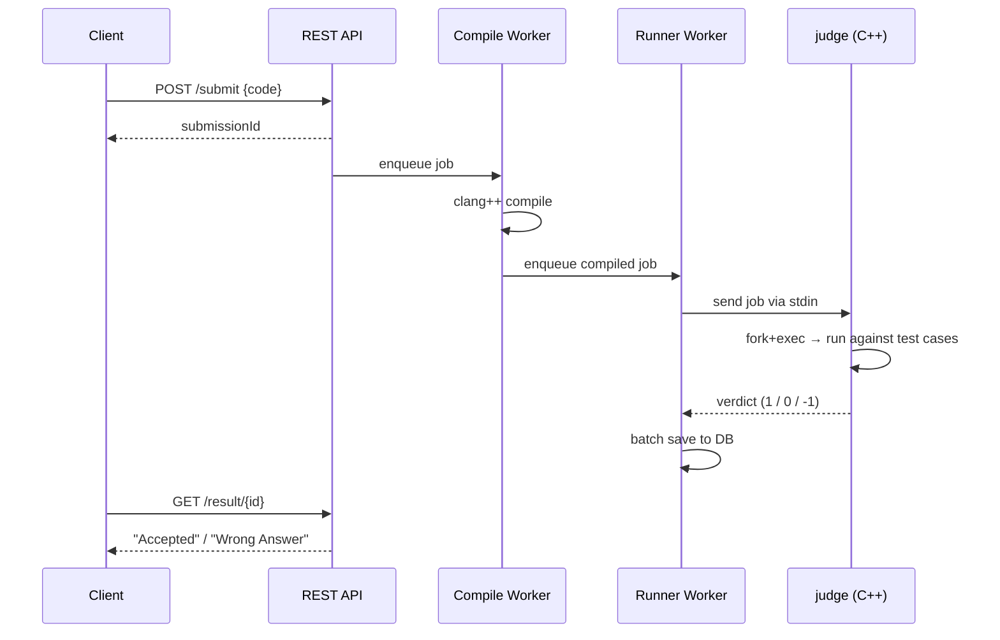
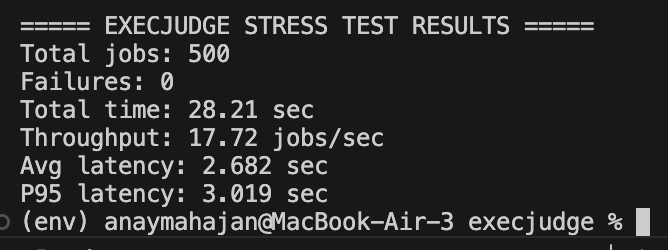
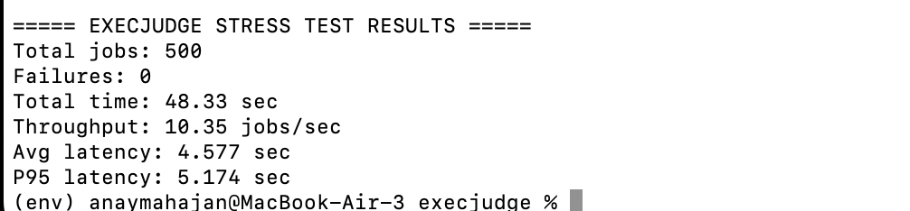

<p align="center">
  <h1 align="center">🧠 ExecJudge</h1>
  <p align="center">
    <b>High-Performance Online Code Evaluation Backend</b>
  </p>
  <p align="center">
    Compile · Execute · Judge — at scale.
  </p>
</p>

<p align="center">
  
  
  
  
</p>

---

**ExecJudge** is a backend system inspired by online judges like **LeetCode** and **Codeforces**. It compiles and executes user-submitted C++ programs in isolated OS processes using an **asynchronous, high-throughput execution pipeline**.

> Designed to safely run untrusted code while maintaining scalability under heavy concurrent load.

---

## 📑 Table of Contents

- [Key Features](#-key-features)
- [System Architecture](#-system-architecture)
- [How It Works](#-how-it-works)
- [Tech Stack](#-tech-stack)
- [Getting Started](#-getting-started)
- [API Reference](#-api-reference)
- [Performance Benchmarks](#-performance-benchmarks)
- [Execution Isolation](#-execution-isolation)
- [Project Structure](#-project-structure)
- [Author](#-author)

---

## 🚀 Key Features

| Feature | Description |
|---------|-------------|
| **Async Job Pipeline** | Producer–consumer architecture decouples submission intake from compilation and execution |
| **Lock-Free MPMC Queue** | JCTools `MpmcArrayQueue` for zero-contention, high-throughput job scheduling |
| **Multithreaded Workers** | Dedicated thread pools for compilation (4 workers) and execution (8 workers) |
| **Persistent Native Runner** | Long-lived C++ judge process eliminates per-job process startup overhead |
| **OS-Level Isolation** | Each user program runs in a separate OS process via `fork()` + `exec()` |
| **Hard Timeouts** | Compilation (2s) and execution timeouts prevent infinite loops and runaway code |
| **Batch DB Writes** | Coalesces up to 50 status updates into a single `saveAll()` call to reduce I/O |
| **Multi-Test Evaluation** | Each submission is evaluated against all test cases for a given problem |

---

## 🏗 System Architecture

### High-Level Overview

```
                            ┌────────────┐
                            │   Client   │
                            └─────┬──────┘
                                  │
                                  ▼
                         ┌─────────────────┐
                         │   REST API       │
                         │  (Spring Boot)   │
                         └────────┬────────┘
                                  │
                    ┌─────────────┴──────────────┐
                    ▼                             ▼
            ┌──────────────┐             ┌──────────────┐
            │ Compile Queue│             │   Database   │
            │ (MPMC 8192)  │             │  (H2 / JPA)  │
            └──────┬───────┘             └──────────────┘
                   │
                   ▼
          ┌─────────────────┐
          │ Compile Workers  │──── clang++ -O2
          │    (×4 threads)  │
          └────────┬────────┘
                   │
                   ▼
           ┌─────────────┐
           │  Run Queue   │
           │ (MPMC 8192)  │
           └──────┬──────┘
                  │
                  ▼
         ┌────────────────┐
         │ Runner Workers  │──── stdin/stdout IPC
         │  (×8 threads)   │
         └────────┬───────┘
                  │
                  ▼
       ┌─────────────────────┐
       │ Persistent C++ Judge │
       │   (fork + exec)      │
       └──────────┬──────────┘
                  │
                  ▼
        ┌──────────────────┐
        │  User Program     │
        │ (Isolated Process)│
        └──────────────────┘
```

### Execution Pipeline



---

## ⚙ How It Works

### The Persistent Native Judge

The most critical design decision in ExecJudge is the **persistent C++ judge process**. Instead of spawning a new OS process for every test case, a single long-lived `judge` binary communicates with Java via stdin/stdout pipes:

```
┌───────────────────────────────────────────┐
│  judge (Persistent C++ Process)           │
│                                           │
│  while(true):                             │
│    read(worker_id, num_testcases)  ◀── Java writes to stdin
│    for each test case i:                  │
│      ① Read tests/{i}.in from disk       │
│      ② fork() a child process            │
│      ③ Child: exec("cpp/{worker_id}")    │
│      ④ Parent: pipe input → child stdin  │
│      ⑤ Parent: read child stdout         │
│      ⑥ Compare with tests/{i}.out        │
│    write verdict (1/0/-1) to stdout ──▶ Java reads result
└───────────────────────────────────────────┘
```

**Why this matters:**
- Process creation (`fork()` + `exec()`) is expensive (~1-2ms each)
- With 16 test cases × 500 submissions = 8,000 process spawns
- Keeping the judge alive saves the **JVM ↔ OS context switch** overhead per submission
- The judge only does `fork()+exec()` for the user program, not for itself

---

## 🛠 Tech Stack

| Layer | Technology | Purpose |
|-------|-----------|---------|
| **Runtime** | Java 17 | Core application runtime |
| **Framework** | Spring Boot 4.0.1 | REST API, dependency injection, lifecycle management |
| **ORM** | Spring Data JPA + Hibernate | Object-relational mapping and repository pattern |
| **Database** | H2 (In-Memory) | Fast, zero-config persistence for submissions and questions |
| **Concurrency** | JCTools `MpmcArrayQueue` | Lock-free multi-producer multi-consumer queue |
| **Execution** | C++17 Native Worker | Persistent judge process for test evaluation |
| **Compiler** | clang++ | C++ compilation with `-O2` optimization |
| **Build** | Maven | Dependency management and build automation |
| **Testing** | Python (requests, threading) | Stress testing and benchmark automation |

---

## 🚀 Getting Started

### Prerequisites

Make sure you have the following installed on your system:

| Tool | Version | Check Command |
|------|---------|---------------|
| **Java JDK** | 17 or higher | `java --version` |
| **Maven** | 3.8+ | `mvn --version` |
| **clang++** | Any recent version | `clang++ --version` |
| **Python 3** | 3.8+ (for stress testing) | `python3 --version` |

### Step 1 — Clone the Repository

```bash
git clone https://github.com/Anay-Mahajan/ExecJudge.git
cd ExecJudge
```

### Step 2 — Compile the Native Judge

The C++ judge binary must be compiled before starting the server:

```bash
clang++ -std=c++17 -O2 -o judge judge.cpp
```

Verify the binary was created:

```bash
ls -la judge
# Should show the compiled binary (~49KB)
```

### Step 3 — Create Required Directories

The system writes compiled user programs to the `cpp/` and `cpp2/` directories:

```bash
mkdir -p cpp cpp2
```

### Step 4 — Start the Server

```bash
mvn spring-boot:run
```

The server will start at:

```
http://localhost:8080
```

You can access the **H2 Database Console** at:

```
http://localhost:8080/h2-console
```

> **H2 Console Credentials:**
> - JDBC URL: `jdbc:h2:mem:execjudge`
> - Username: `sa`
> - Password: *(leave empty)*

### Step 5 — Create a Question and Load Test Cases

First, create a question:

```bash
curl -X POST http://localhost:8080/api/task/create \
  -H "Content-Type: application/json" \
  -d '{
    "title": "Tower of Hanoi",
    "content": "Print all moves to solve Tower of Hanoi for n disks",
    "constraints": "1 ≤ n ≤ 16",
    "inputFormat": "Single integer n",
    "outputFormmat": "Number of moves, then each move as two integers"
  }'
```

Then load test cases (16 test cases are provided in the `tests/` directory):

```bash
python3 CreateTestCase.py
```

### Step 6 — Submit Code for Evaluation

```bash
curl -X POST http://localhost:8080/api/process/1/submit \
  -H "Content-Type: application/json" \
  -d '{
    "code": "#include <iostream>\nusing namespace std;\nint main() {\n    int n;\n    cin >> n;\n    cout << (1 << n) - 1 << endl;\n    return 0;\n}"
  }'
```

Response:
```json
42
```

Poll the result:

```bash
curl http://localhost:8080/api/process/42/result
```

Response:
```
"Accepted"
```

### Step 7 — Run Stress Tests (Optional)

```bash
# Install dependencies
pip3 install requests

# Run the stress test (8 clients × 8 submissions = 64 concurrent jobs)
python3 stress_test.py
```

---

## 📬 API Reference

### Process Endpoints

#### Submit Code

```http
POST /api/process/{qid}/submit
```

Submits C++ code for asynchronous compilation and evaluation against all test cases.

| Parameter | Type | In | Description |
|-----------|------|-----|-------------|
| `qid` | `int` | path | Question ID to evaluate against |
| `code` | `string` | body | C++ source code |

**Request Body:**
```json
{
  "code": "#include <iostream>\nusing namespace std;\nint main() { ... }"
}
```

**Response:** `200 OK`
```json
42
```
Returns the submission ID (integer) for polling.

---

#### Get Result

```http
GET /api/process/{sid}/result
```

Polls the current status of a submission.

| Parameter | Type | In | Description |
|-----------|------|-----|-------------|
| `sid` | `int` | path | Submission ID |

**Response:** `200 OK`
```json
"Accepted"
```

**Possible statuses:**

| Status | Description |
|--------|-------------|
| `Queue` | Submission is waiting in the compile queue |
| `Running` | Code is being compiled or executed |
| `Accepted` | All test cases passed ✅ |
| `Wrong Answer` | One or more test cases failed ❌ |
| `Compilation Error` | Code failed to compile |
| `System Error` | Internal error during processing |
| `Judge Error` | Native judge process encountered an error |

---

#### Run Code (Ad-hoc)

```http
POST /api/process/{qid}/run
```

Synchronously compiles and runs code with custom input. Does **not** evaluate against test cases.

**Request Body:**
```json
{
  "code": "#include <iostream>\nusing namespace std;\nint main() { int n; cin >> n; cout << n * 2; }",
  "input": "21"
}
```

**Response:** `200 OK`
```json
{
  "output": "42\n"
}
```

---

### Task Endpoints

#### Create Question

```http
POST /api/task/create
```

**Request Body:**
```json
{
  "title": "Two Sum",
  "content": "Given an array of integers...",
  "constraints": "2 ≤ n ≤ 10^5",
  "inputFormat": "First line: n. Second line: n space-separated integers.",
  "outputFormmat": "Two indices (1-indexed)"
}
```

---

#### Add Test Case

```http
POST /api/task/addTestCase
```

**Request Body:**
```json
{
  "qid": 1,
  "input": "5\n",
  "expectedOutput": "31\n1 3\n1 2\n3 2\n1 3\n2 1\n2 3\n1 3\n..."
}
```

---

#### Get Question

```http
GET /api/task/{qid}
```

Returns full question details including title, content, constraints, and examples.

---

### List Endpoints

#### List All Questions

```http
GET /api/list/allquestion
```

**Response:** `200 OK`
```json
[
  { "id": 1, "title": "Tower of Hanoi" },
  { "id": 2, "title": "Two Sum" }
]
```

---

## 📈 Performance Benchmarks

Stress tested with **500 concurrent submissions** on a MacBook Air (Apple Silicon).

### Benchmark Results

| Workload | Total Jobs | Failures | Throughput | Avg Latency | P95 Latency |
|----------|-----------|----------|------------|-------------|-------------|
| **Moderate** (algorithmic) | 500 | 0 | **17.72 jobs/sec** | 2.682s | 3.019s |
| **CPU-Heavy** (Tower of Hanoi, n ≤ 16) | 500 | 0 | **10.35 jobs/sec** | 4.577s | 5.174s |

### Stress Test Screenshots

#### Moderate Workload — 17.72 jobs/sec



#### CPU-Heavy Workload — 10.35 jobs/sec



### Key Takeaways

- ✅ **Zero failures** across all 500 submissions in both tests
- ✅ **Sub-5 second P95 latency** for moderate workloads
- ✅ **Consistent throughput** — the pipeline handles backpressure gracefully
- ✅ **Linear scaling** — throughput is proportional to worker count

---

## 🔒 Execution Isolation

ExecJudge employs multiple layers of isolation to safely run untrusted code:

```
┌──────────────────────────────────────────────┐
│                JVM (Spring Boot)              │
│  ┌────────────────────────────────────────┐   │
│  │           judge (C++ process)          │   │
│  │  ┌──────────────────────────────────┐  │   │
│  │  │     User Program (forked child)  │  │   │
│  │  │                                  │  │   │
│  │  │  • Separate OS process           │  │   │
│  │  │  • Redirected stdin/stdout       │  │   │
│  │  │  • No access to judge memory     │  │   │
│  │  │  • Killed on timeout             │  │   │
│  │  └──────────────────────────────────┘  │   │
│  └────────────────────────────────────────┘   │
└──────────────────────────────────────────────┘
```

| Isolation Layer | Mechanism |
|-----------------|-----------|
| **Process Isolation** | Each submission runs as a separate OS process via `fork()` + `exec()` |
| **I/O Redirection** | stdin/stdout are piped through file descriptors — no terminal access |
| **Compilation Timeout** | `clang++` is killed after **2 seconds** if compilation hangs |
| **Execution Timeout** | Ad-hoc `/run` executions are killed after **100 seconds** |
| **Output Cap** | Program output is truncated at **64 KB** to prevent memory exhaustion |
| **JVM Protection** | The JVM never directly executes user code — all execution happens in native child processes |

---

## 📁 Project Structure

```
execjudge/
│
├── src/main/java/com/anay/execjudge/execjudge/
│   ├── ExecjudgeApplication.java              # Spring Boot entry point
│   │
│   ├── controller/
│   │   ├── ProcessController.java             # /api/process — submit, result, run
│   │   ├── TaskController.java                # /api/task — questions & test cases
│   │   ├── ListController.java                # /api/list — list all questions
│   │   └── ExecResponse.java                  # Response wrapper DTO
│   │
│   ├── model/
│   │   ├── Submission.java                    # JPA entity — submission lifecycle
│   │   ├── Question.java                      # JPA entity — problem statements
│   │   ├── TestCase.java                      # JPA entity — input/output pairs
│   │   ├── Execution.java                     # DTO for ad-hoc /run requests
│   │   └── QuestionTitleId.java               # Projection DTO for listing
│   │
│   ├── repo/
│   │   ├── ProcessRepo.java                   # Submission JPA repository
│   │   ├── QuestionRepo.java                  # Question JPA repository
│   │   └── TestCaseRepo.java                  # TestCase JPA repository
│   │
│   └── service/
│       ├── ProcessService.java                # ⭐ Core pipeline orchestrator
│       ├── CompilationService.java            # clang++ compilation + execution
│       ├── BatchSubmissionService.java        # Batched DB persistence
│       ├── QuestionService.java               # Question CRUD
│       └── TestCaseService.java               # TestCase CRUD
│
├── src/main/resources/
│   └── application.properties                 # Spring Boot + H2 configuration
│
├── judge.cpp                                  # ⭐ Persistent native C++ judge
├── judge                                      # Compiled judge binary
├── tests/                                     # Test case files (*.in / *.out)
├── cpp/                                       # Compiled user submissions (runtime)
├── cpp2/                                      # Ad-hoc /run compiled binaries
│
├── stress_test.py                             # Load testing script
├── CreateTestCase.py                          # Bulk test case uploader
├── payload.json                               # Sample API payloads
├── pom.xml                                    # Maven build configuration
│
├── Stress_Test_Result1.png                    # Benchmark screenshot (CPU-heavy)
└── Stress_Test_Result2.png                    # Benchmark screenshot (moderate)
```

---

## 👨‍💻 Author

**Anay Mahajan**

[](https://github.com/Anay-Mahajan)

---

<p align="center">
  <i>Built with ☕ Java, ⚡ C++, and a passion for systems programming.</i>
</p>
